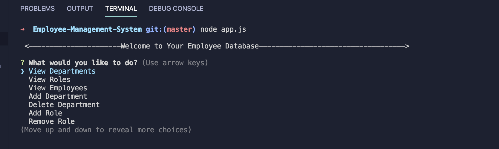

# Employee Database 
      
    

## Description 
This application allows a user to store data using a backend MySQL database to store information about departments, roles, and employees. It will also enable the user to view departments, roles, and employees. This will also allow the user to delete any one of those options or add to it. This Project focuses heavily on Node.js and MySQL.



## Demo
This link shows a vidoe of the working application.   
https://youtu.be/CKY0qaNCSzM

## Table of Contents
* [Installation](#installation)
* [Usage](#usage)
* [License](#license)
* [Contribution Guidelines](#contribution-guidelines)
* [Tests](#tests)
* [Questions](#questions)
## Installation
To installrun the following command:
``` npm i ```
## License
This project is licensed under ISC license.
## Contribution 
Rayan Ahmedy 
## Tests
Run the following command:
``` npm test ```


Contact ahmedyrayan2020@gmail.com
##
GitHub account:  https://github.com/@rahmedy

